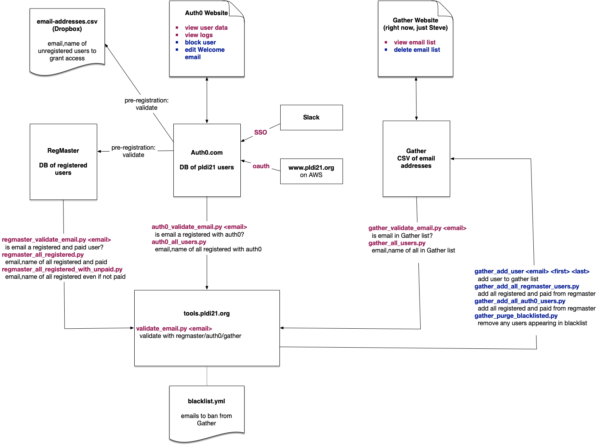

# Admin Docs

## 

## [Website Monitoring](monitor.md)

## EC2 Admin Machine

* `ssh ...`
* private key: get from Steve
* PLDI-Mini-Conf repo will use keys for `pldi21` account on Github.

## Services

* Auth0 Admins: <https://manage.auth0.com/dashboard/us/dev-tdha92d1/>
    * ...
    * Arjun (Google sign on)

* Slack Admins: <https://PLDI21-Test.slack.com> 
    * ...
    * ...

* Gather Admins: <https://gather.town/app/aaaaaaaaaaaa/pldi21>
    * Right now, Just Steve.

## Fake Home Page: 

* Goto Here: <http://www.cs.williams.edu/~freund/pldi-index.html>
* Register fake users
* Try to Sign up for <https://www.pldi21.org> with good/bad email addresses.
    - Flush Web cache / cookies to force new Auth0 login attempts. 
* Try to Sign into all of our systems.
* Uses Slack invites instead of SSO for now.

## Admin Tools

### [Updateing The Web Site](site.md)

### [Perform Basic Operations for Users](basic-ops.md)

### [ACM Zoom Licenses](https://www.acm.org/special-interest-groups/volunteer-resources/conference-planning/conference-planning-guide-secondary-pages/zoom-meeting-guide)

## Other

### [Failure Plans](failures.md)

### [Low-Level APIs](apis.md)

### [Auth0](auth0.md) Hook Setup

